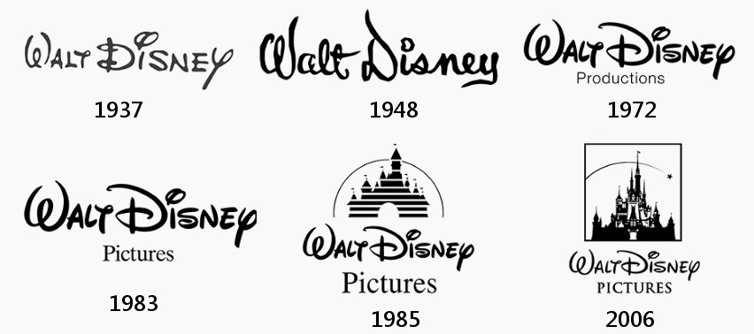

**Did you know that the brand image of *Disney* changed just slightly over the last 100 years?** **Have you ever thought of the impact the *Disney* logo had on you before starting a movie? Have you been in the cinema, staring at the screen, while the heavily detailed and up-to-date 3D animation of the Disney castle came up? Your body buzzing with adrenalin and excitement to see the new work of creative heads?** 

**Well if not– don't worry– *Typologically* got you!**

Everyone started somewhere, and so did *Walt Disney*. It was not until 1937 that Disney created a recurring logo – and it changed several times. During that time *Disney* started to gain more popularity after several ups and downs; which is, most potentially, the reason for a fixed logo. 

### The Beginning

Starting with a simple curvy *Walt Disney*, followed by a more edgy style of cursive letters in 1948; both already showed the tendency of a signature or handwritten font. However, the regular weight of the font as well as the low contrast did not let the logo stand out. Its condensed width was present right from the start. The second change of the font in 1972, is the one we still see and love nowadays. The x-height is lower, to emphasize the W and D. Another change is the heavier weight as well as the contrast of font, which is relatively high now. All of those details lead to a more outstanding handwritten style of font, which is easy to recognize. Over the years some 'add-ons' of the logo were developed. 

First, the line of ‘productions’ was added in a simple low contrast, condensed, and light Sans Serif font (1972). In 1983 the line ‘Productions’ was substituted by ‘Pictures’ in a regular Serif font. Through that change, the reader started to connect *Walt Disney* movies with the wold 'pictures', which were written in relatively low x-height.

It wasn't until 1985, that the famous illustration of the *Disney* castle in the background was edited. The, so far, last change was made in 2006. Again, just the edit of the castle was reframed and modernized. It’s now illustrated with much more detail in a square frame. 

What’s the logic behind that? *Typologically* thinking it is clear that the slight adjustments during the time helped *Disney* to support their brand identity, making it recognizable over generations. 

> Disney’s logo design is dedicated to showing their advances in graphics and animation’ (Logomyway)

In other words, the company constantly showed its skills through its logo; the film industry is a highly competitive market, but *Walt Disney* managed to stand out. The usage of a handwritten font gives the audience a voice of personality. This perfectly suits the brand image of family production services and at the same time, is suggesting that the company 'cares' for every single person of its audience. The childhood illusion of a perfect dream universe is embodied. 

Since their massive impact on the industry and their success as a brand, they reuse their logo with slight changes for every area, where they develop new media products. Such as the *Disney+* or the *Disney Channel* logo.

### Spot the Difference?!

Wanna have a look at their past history? Check this youtube video out. It will show you a collection of *Walt Disney* trailers from 1937-2019 with all their intro logos! You will quickly realize how enormous their technical developments over time were. Some may even realize how they made slight adjustments to their intro depending on the type of movie they represented. 

<iframe width="560" height="315" src="https://www.youtube.com/embed/pib5rDbHyz0?rel=0" allow="accelerometer; autoplay; encrypted-media; gyroscope; picture-in-picture" allowfullscreen></iframe>

### Personal Perspective

When you look at the logo, from a very personal perspective, you might connect special feelings from your childhood with it. For many people, *Disney* with its castle evokes beautifully dreamy fantasies and embraces the doorstep to childhood dreams. It's psychologically proven that your brain connects different aspects of your childhood experience with something positive. This is why adults tend to re-experience childhood memories, to evoke the positive emotions they had a couple of years before. 

**Let me know in the comments how you feel about *Disney* and its brand identity! Are you a fan or could *Walt Disney* never catch you into his dreamy Universe?**

Further Websites:

Designyourway, ‘The Disney logo and all there is to know about the Walt Disney brand’, *Design your way* \[online] Available at: <https://www.designyourway.net/blog/graphic-design/the-disney-logo/> (Accessed: 24 September 2021)

Logomyway, ‘Disney Logo and Its History’, *Logomyway,* \[online] Available at: <https://blog.logomyway.com/history-disney-logo-design/>  (Accessed: 24 September 2021).

Rogoza, R. (2020) ‘What Famous Castle Is Depicted on Disney Logo?’, *Logaster,* 30 March. \[online] Available at: <https://www.logaster.com/blog/walt-disney-logo/> (Accessed: 26 September 2021)