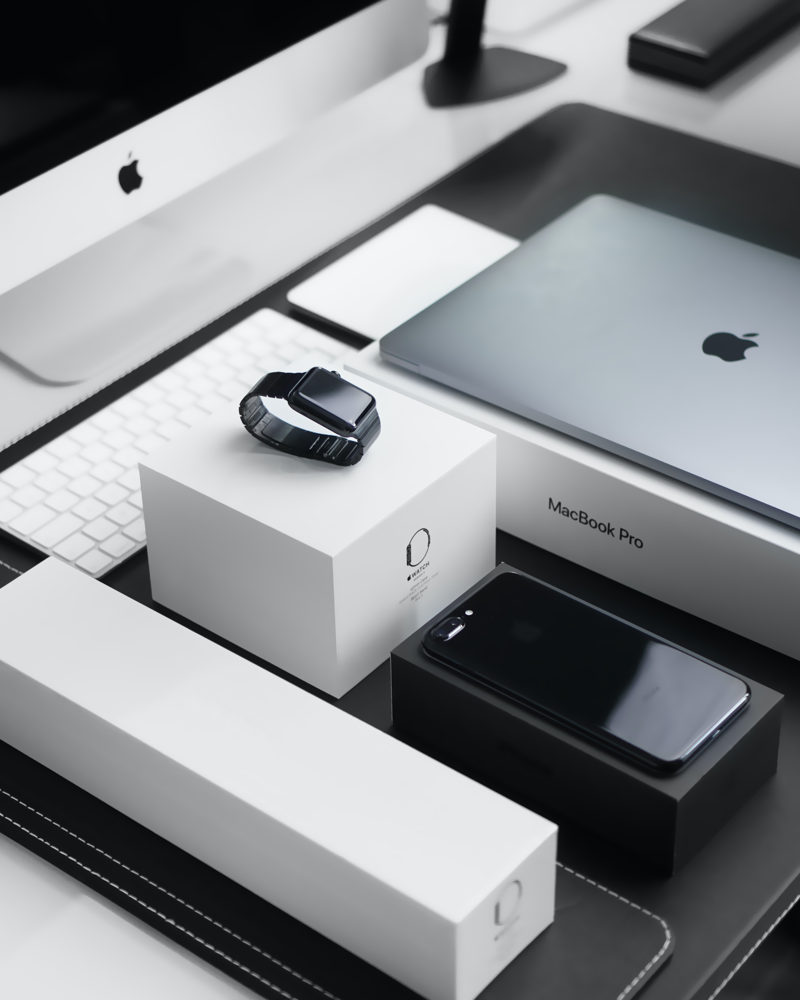

**Have you realized that the brand Apple does not use any extra typography within its design? Do you know what their typography is, next to their famous apple icon? Let’s let Typologically find out.** 

**Apple, nowadays, is a very popular wide-ranging brand. In the past the company struggled with ups and downs; however, the Logo and its typography stand out. But what do we know about the apple logo? And why do we not see its typography in the first place?**

## Logo History

Its companies first logo wasn’t the apple itself. It was *Newton* under the famous apple tree. Who of you did his physics homework and knows what *Newton’s* discovery was? 

Indeed–the law of gravity. 

When *Steve Wozniak* and *Steve Jobs* founded the *apple* company in 1976, they wanted to emphasize the beginning of the IT revolution. Like Newton’s theory, which illustrates the beginning of science. 

Both quickly realized that the illustration of the *Newton* scene will not help them in their brand development. The simple apple design we know currently, is still the one that was developed 44 years ago.  

In the creation process *Rob Janoff*, the designer, realized some difficulties. The classic shape of an apple could be confused by other fruits such as cherries or tomatoes. A bite was the quick solution to avoid any troubles and luckily at the same time provided a similarity to the technical term ‘byte’ \[Abrosimova, 2020]

 Well, that explains the logo but what is about the typography? 

## *Apples*-font mystery; solved

To the basic and minimal design of the icon was a suitable font needed. *Apple* quickly realized that it was not necessary to spell out their company name. So, its logo was quickly introduced in its font as well. 

The font *apple* uses are called Myriad, it is a sans serif font. It is famous for its clean shapes and precise letters. The width and weight are regular, its contrast and x-height low. For the user, it is very easy to read, which at the same time underlines the brand image of *apple* with its minimal sleek design and user-friendly surfaces’. 

 

*Apple's* voice outlines in every possible way (Design of logo and typography) its brand image. It is with its focus on IT and tech, digital and luxury. Their products are known for trustworthy technologies, easy surfaces, and consumer-friendly luxury. Its designs are clean and straight forward giving the feeling of a traceable company, evoking trust. 

Indeed, the *apple* website promotes with the following quote: 

> **“We do the right thing, even when it’s not easy.” ~ Tim Cook**

### Final thoughts

In conclusion, *apple* did a wonderful job in its design and brand development. The typography supports the icon and its norms and values to 100%. No extra text is needed to promote their products. Which, at the same time, supports their minimalism and digital surrounding.

**What do you think is *apple* as trustworthy as its user-friendly surface? And did you realize what kind of typography stands next to the world-famous icon?** 

 

Sources:

Abrosimova M. (2020). ‘Apple Logo History: All About Apple Logo Evolution’ *The Designest.* (7 September). \[online] Available at: <https://thedesignest.net/apple-logo-history/> (Accessed: 27 September 2021)‌

Adobe, ‘Myriad’ by *Adobe* \[online] Available at: <https://www.myfonts.com/fonts/adobe/myriad/> (Accessed: 27 September 2021)

Apple Inc. (2021), ‘Ethics and Compliance’ *Apple Inc.* \[online] Available at:<https://www.apple.com/compliance/> (Accessed: 27 September 2021)