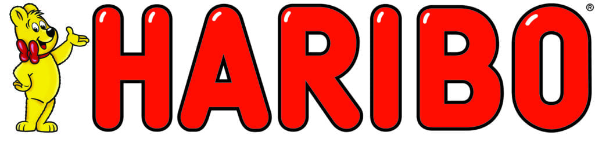
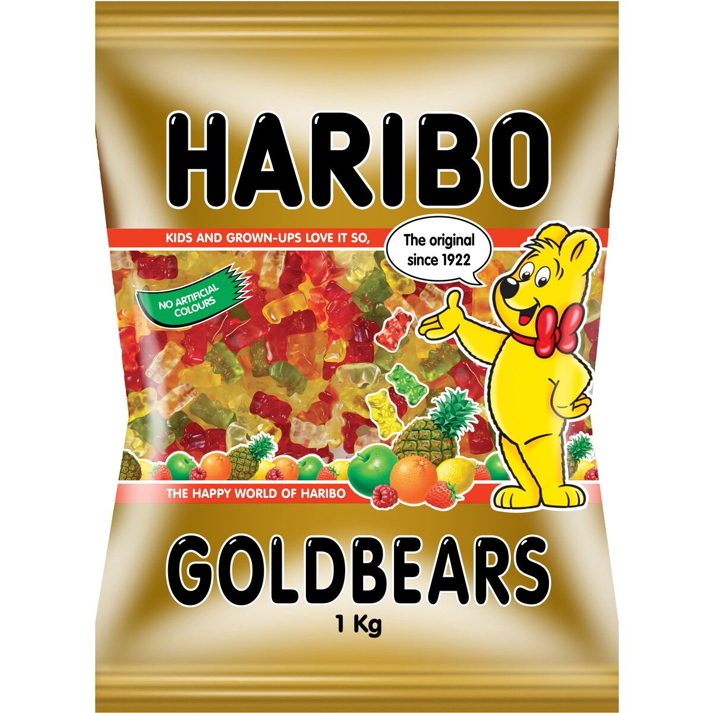

**What colour is your favourite from the HARIBO bears? Did you know that Haribo is 101 years old and originated in Germany? Its brand identity developed during the time; known for great quality, tasty experience and family friendly fun. Let’s have a look at how many clues we get from a single candy pack and what makes them so famous in comparison to other companies.** 

 

The Design of the Logo represents the name. It is an acronym for the founder of the company. HA: Hans, RI: Riegel BO: Bonn. Hans Riegel was the founder of the brand, located in Bonn a city in Germany. 

The HARIBO brand design above is the modern interpretation which is in the stores for many years now. When you look at it you might even connect some childhood memories to it (that's how old it is, yes). But in case you want to know more about the old logos, I linked a video at the end of this post. 

### Let's start typologically thinking

The typography is a bright red sans serif font with rounded edges to give it a gummy look alike. It is condensed, low in contrast, and heavy in weight. The outline of it is black, bringing it out. Over time some highlights in the red font were developed to express the shininess of its appearance. The mascot next to the typography is the famous yellow bear, which at that time represented a dancing bear, with a red bow tie. 

Through the composition of the red font, which clearly draws a lot of attention, and the yellow smiling bear, it all seems very suitable for children and parents as they like to state on their website. However, the Logo shows some variations depending on the specific candy pack they sell. And why is the bear yellow? 

The most famous variation of gummy is their Goldbear pack, 1922 developed and the first gummy bear worldwide. The size and color we know now is an update to the original two colors and bigger-sized “dancing bears”. The mascot represents the Goldbears, the candy Haribo became famous for.

 

**Let’s have a look at the famous candy pack.** 

 

As you can see, the Logo and title of the candy is the brand font, but in black color with white highlights and outline. The original red is used to emphasize their motto:

>  "kids and grown-ups love it so, the happy world of HARIBO"

This statement outlines why they exist as a company and who they are making it for (to make kids and grown-ups happy) as well as, what makes them special (happy world of HARIBO). When we have another look at the candy bag, we see the green sign of “no artificial colours” does this tell you anything else about their brand identity?

 Yes, of course, HARIBO seems to value the quality and the originality of its products. With its statement it seems to be more suitable for children and their parents, giving it a healthier appearance. Especially their imagery of the fruits at the bottom banner underlines the potential healthy statement of the brand. 

Even if we know that candy with sugar cannot be healthy by any means. The brand identity completely supports their family-friendly statement.

Did you recognize their colour code? HARIBO has very colourful packages, but they never leave out the colours black, red and yellow. What at the same time portraits the colours of the German flag. 

Check out this video if you have further interest in the development of the logo history, especially if you want to see the old logo and font: 

<iframe width="560" height="315" src="https://www.youtube.com/embed/Nk9WOLsQMQI?rel=0" allow="accelerometer; autoplay; encrypted-media; gyroscope; picture-in-picture" allowfullscreen></iframe>

**Meanwhile, let's munch on some candy and comment below what type of HARIBO is your favourite? What do you think about the brand itself? Does it remind you of your childhood?** 

 

 

 

 

 

 Sources:

FAMOUS LOGOS (2013). *Haribo Logo*. \[online] FAMOUS LOGOS. Available at: https://www.famouslogos.org/logos/haribo-logo \[Accessed 7 Oct. 2021].

HARIBO (n.d.). *Milestones throughout HARIBO’s unique success story*. \[online] HARIBO. Available at: https://www.haribo.com/en-gb/about-us/history.

‌