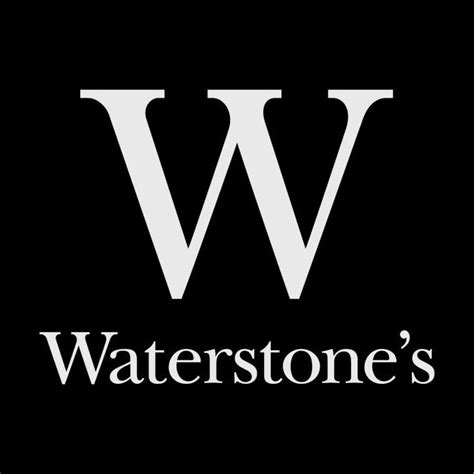

**Waterstones is a highly modernized version of a traditional bookshop. How can traditional bookshops such as Blackwell’s in Oxford keep up with their competition? Waterstones vs. Blackwell’s, the fight of two masters will be explored in detail below…**

 

Waterstones history began in 1982, the chain quickly introduced some customer services such as its own coffee shop and gifts. However, its brand appearance and logo never changed. Nowadays, the chain owns more than 280 shops in the UK. 

*Typologically* thinking, it stands out quickly that the brands' identity developed with the media revolution of the 2000s. However, it grew in a different direction than Blackwell’s. Let’s dive deeper into the book. In the following, we will break up the pieces and clues we get from the Waterstones brand identity.

 

#### 1. Logo and Typography: 

The Waterstone logo is the ‘W’ of the typography. Either black background and white font or the other way around. Its style is a Serif font, condensed with medium x-height, regular weight, and contrast. The ‘W’ has high contrast, emphasizing it, underlining the logo as well.

 

#### 2. Colour:

The colours for the logo could represent black ink on white paper. It gives a feeling of the past typewriters and an atmosphere of a classic old bookshop like the company states:

> ‘Waterstones – Your Local Bookshop’

The colours of the font for the store headings vary from gold to white on black background. In Oxford for example is the brand golden, which is most probably related to the type of building. It represents the age of the building, and the sand walls give the brand a warm and old atmosphere.

 

#### 3. Arrangement:

The arrangement of the bookstore itself is a key clue to understand the difference between the two companies. Of course, every store should have a specific order, to enable great customer service. However, looking into the store it becomes clear that Waterstones is a very modern interpretation of a classic bookstore. It got space in between shelves sometimes filled with gifts. Through white colours and glass, the room receives more light, supporting the customers in their decision what to buy. It’s not a cozy corner you would take your book to. But Waterstones has a solution for that! Their Waterstones Cafés allow the consumer to stay for longer in a nice atmosphere. The image below shows a very modern version of a bookstore/library as an example of how light can change the atmosphere. 

 

#### 4. The Brand and its tone

  How do all these clues help us to understand the brand Waterstones? Is the typography of any importance at all? 

Yes, it is! The brand reputation of a modern bookstore, family-friendly and with great customer service is underlined and expressed in their logo and typography. The statement on their main website (stated above) explains to us why Waterstones is here… the local bookstore for everyone. Does Waterstones seem like a local bookstore instead of a chain giant? The typography of the brand tries to capture their stated identity, introducing a typewriting style. 

 

However, the customer itself needs to decide what he prefers. It’s all about the choices, and because Waterstones is so different in comparison to their counterparts, they can co-exist. 

 

**Check out part 2, to understand how Blackwell’s supports its brand and tries to win that battle!**

**Let me know in the comments how you think about Waterstones! Do you prefer light-flooded bookstores to classic bookshops?** 

 

  

References:

Waterstones Booksellers Limited (2019). *About Us | Waterstones.com Help | Waterstones*. \[online] Waterstones.com. Available at: https://www.waterstones.com/help/about-us/44.

‌