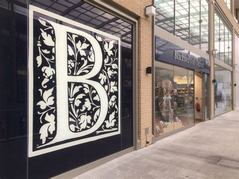

**After examining the first competitor we will now focus on Blackwell’s and its power. How will the fight end, is there an ending at all? Check it out below.**

  

Blackwell’s history started in 1879 and could be the older brother of Waterstones. It is also a book chain owning more than 30 stores. Some of them are specified in different topics. But let’s explore their key clues first. 

 

#### 1. Logo and Typography:

The Blackwell logo is the ‘B’ of the typography.  It is centered as a white letter in a royal blue square with a flower pattern. 

The typography is a Serif font, condensed, regular weight, and regular contrast. The sign is either blue in white (again giving the message of ink on paper) or the other way around. 

The font gives the customer the feeling of a typewriter and underlines their history as a bookstore. The logo is simple and for some probably nonexisting, the brand normally uses the whole name of the founder to present it which is why an extraordinary logo is mostly unnecessary and might draw the customer's attention towards a different direction. However, the logo with its flower patterns in the background enlightens the **B** a bit and makes it creative. As if you’re ready to dive into a new story world.

**\->** So, the logo and its typography are not that different compared to the one from Waterstones. Both keep a certain style, giving the atmosphere of a local bookshop.

  

#### 2. Colour: 

 Royal blue as mentioned before, illustrates often blue ink. However, that deep blue colour also carries the feeling of something special, reliable, and trustworthy. Blackwell’s brand relies on its reputation, and they are proud of their age! Through their specification of topics for some bookstores, they need to ensure that their customers believe in their professionality as well as in their originality. 

 

#### 3. Arrangement: 

Blackwell’s has many modern books and some gifts; however, the majority is high-quality products within a wide range of topics. Many academic and educational books can be found next to their consumer sector. They adjusted their offer to the trends of the time, underlined through specializing in some topics for specific stores. For example their Art and Poster shop, or music centered shops. 

When you step into a Blackwell’s you will be in an arrangement what you would probably call a classic bookstore. Mostly carpet and dark wooden shelves are used. It is very cozy but can be a labyrinth for some people out there. The oldest store in Oxford is famous for its circle of bookshelves, surrounding a lower platform with more books and seats, often used for events.

 

Below I added an example of dark wooden bookshelves, to show you what kind of atmosphere I am thinking of. 

 

#### 4. The brand and its tone 

So how does the typography and design help Blackwell’s to carry on with their past book history? 

Blackwell’s is the classic local shop you are thinking of; however, it is bigger than you might imagine. With the familiar and cozy atmosphere and the trust of academics developed during the time its tone screams ‘come here, I am the old wise bookstore helping you out.'

The company is fully represented through its name; the typography underlines its history and as mentioned before, the blue gives a trustworthy feeling. 

**\->Overall no special Logo is needed.**

 

## \-Blackwell’s V.S Waterstones-

 

Who would be the winner of the fight? *Typologically*, the question needs to be rephrased. 

None of the brands could be the overall winner. Waterstones is with its extra customer services such as the café more suitable for other audiences, for example, families who want to settle after exploring the light-flooded bookshelves a level below.

Blackwell’s on the other side is suitable for booklovers who directly want to dive into the book or might look for something special. Through their focus on different topics and their well-known reputation of high-quality academic products, Blackwell’s attention is clearly drawn by other customer groups.

Both Book chains have their own qualities and appearances, which Bookstore would win this fight is a choice of taste and value. But I can comprise, whoever loves books will be happy to step in either of these bookstores. 

 

**What do you think! Who is your personal winner? Do you prefer modern design or like the cozy dark appearance?** 

 

 

References:

Blackwell Ltd. (n.d.). *140 years at Blackwell’s*. \[online] blackwells.co.uk. Available at: https://blackwells.co.uk/bookshop/about.

Campbell, L. (2017). *First look inside the new Blackwell’s Westgate | The Bookseller*. \[online] www.thebookseller.com. Available at: https://www.thebookseller.com/news/first-look-inside-new-blackwells-westgate-658636.