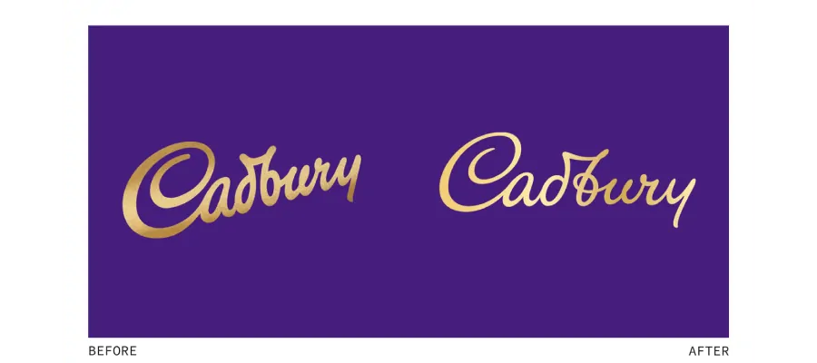
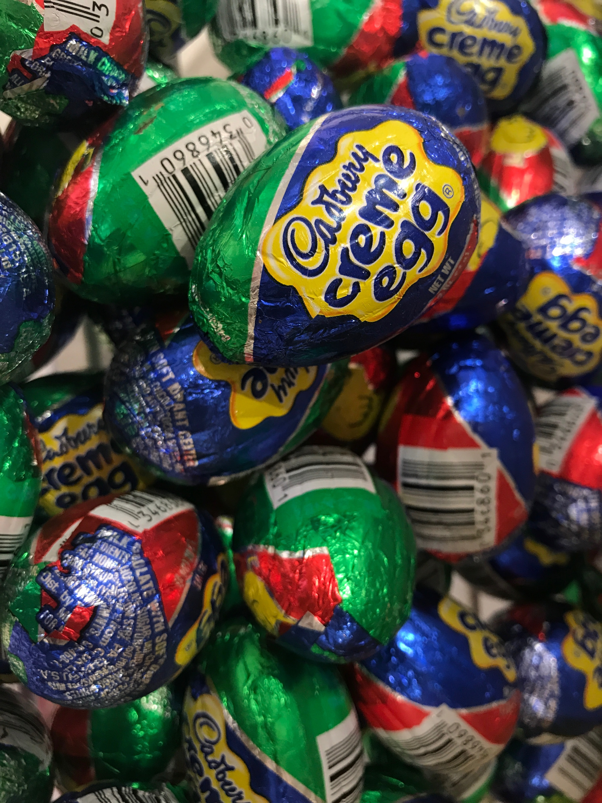
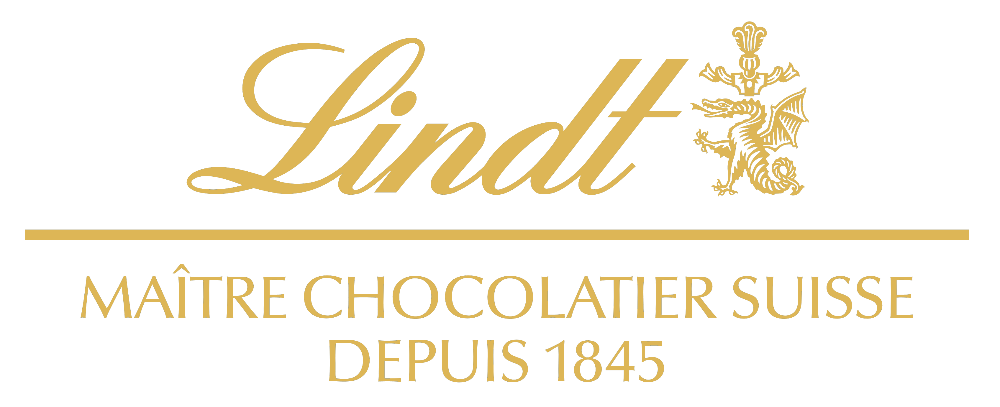

**Is chocolate just chocolate? Or do you have specific preferences regarding brand and look? The difference between the two famous beloved chocolate companies will be outlined below. Cadbury vs. Lindt in what team are you? Let's find out!**

## Choco History

*Cadbury* was founded in Birmingham, 1824. The company started on a small scale. John Cadbury aimed to sell his chocolate powder and drinks as a substitution for alcohol, advertising a healthier lifestyle \[Mondelez]. It wasn't until 1849 that *Cadbury* produced the first UK chocolate bar. 

A couple of years earlier, *Lindt* was established, to be precise 1845. The Sprüngli Brothers' goal was to be the first company producing solid chocolate for the swiss german area \[Lindt&Sprüngli].

Both businesses achieved major steps in the development of chocolate. *Cadbury* created, with the use of pure cacao, the first easter egg in 1875. *Lindt* achieved to develop the first melting chocolate worldwide in 1879. 

So what is the difference between the brands if both achieved milestones in chocolate production? 

Let's typologically analyse the cocoa of the bean. 

#### Logo&Typography

##### 1. Cadbury

Even though Cadbury changed its font in 2020, its purple colour will always implement the brand Cadbury. Many cannot imagine the brand without the outstanding colour set. First used in 1920, the colour 2685 C, is over a hundred years old. 

Purple gives a feeling of luxury and speciality. Historically, purple was mostly used in royal families, due to its costs. Before globalisation and technologies, it was hard to craft the colour due to the limited capacities of material. Nowadays, the colour is often used for chocolate brands (Dairymilk, Milka), it emphasizes a small treat of luxury in daily life. 

The two different fonts have many things in common. Its handwritten style is golden with low x-height and some shadow details. 

Past: The condensed font is heavyweight and regular in contrast, it is aligned at a 30-degree angle horizontally and made the C jump out. Through the movement, it seems fun and active. 

Present (2020): The condensed font is lightweight and the high contrast underlines the curves of the handwriting. Additionally, it is now aligned horizontally and seems neater. With its higher contrast in comparison to the old logo, it seems less playful but more luxurious. 

Those slight changes can have a higher impact on the consumer. The brand clearly tries to implement new values to sell more products. With its new logo, it underlines the message that they want to sell good quality chocolate for everyone. Now, with the less playful voice, it might help to win new audiences. 

The famous Cadbury egg, for example, is very colourful, inviting especially kids and families to buy it. 

##### 2. Lindt&Sprüngli

Lindt&Sprungli; nowadays a cooperative company, was, as mentioned above, founded by two brothers. Even though the company's cooperation changed its partners a couple of times, due to licensing and takeovers, the brand and logo never really changed. 

Of course, its logo wasn't as colorful and precise at the beginning. But its handwritten italic condensed font, regular weight, and high contrast were always present.  The dragon next to the Lindt signature is originally part of the family weapon, and some people assume that the dragon symbolizes the barrier to let the rest of the signature melt away.

> "The dragon is there, watching, making sure everything remains controlled and premium. That's the reason why you can indulge in Lindt chocolate without fearing of losing control." \[J.Sharp 2018]

A thin line separates the signature with the since 1845 description of the chocolatiers. Written in high caps and sans serif font. 

The french language and the different font clearly separate it from the company name. The usage of the French language makes it stand out it's less reachable. Through that distance, a feeling of premium content and luxury is created. 

This is also underlined by the thin, delicate line and usage of golden colour.