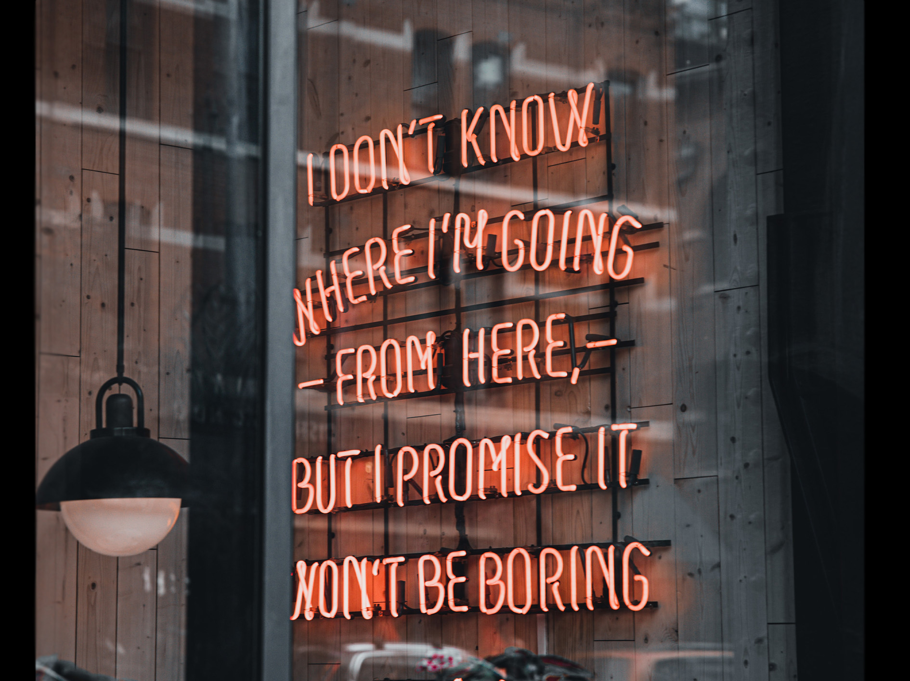

*Typologically*? Ever heard of it? What does it even deal with? 

I created that website to logically explain everyday typography–So far so good. 

#### **But why?**

The 'why' question is the most essential question I would ask myself every day. Typography is everywhere around us. To observe some little things in life might make it way more exciting to you! (At least I am happy about every new logic behind a small thing) 

So let's start our **adventure** together and explore the world! Most of my articles will be personally influenced by my favourite topics: Arts&Tech, Books & Food. 

##### Logo logic

My logo is a match of the famous atomic movements of an electrolyte, plus the *Typologically* T of the Font. The font underlines the typewriter style from the old-times. And the pink colour splashes should bring some movement in my logo and give it an artistic style. 

The Branding itself is the combination of clean scientific colours (blue,black and white) with a creative spin of the *Typologically* pink and serif font with higher contrast. You might realize, when you have another look at my banner at the front page, that I mixed the technologial LED font with my pink creative bland of the *Typologically* font. 

##### the Ending

The biggest and most valuable part about *Typologically* are the different opinions and thoughts you might take from it home. It's enormous how many emotions you can connect to small things, which have greater impact on the design and brand identity. 

So, please let me know what you think and what topics I should cover as well! 

Take care everyone and have as much fun as me, while exploring for you.

xxx Jill

